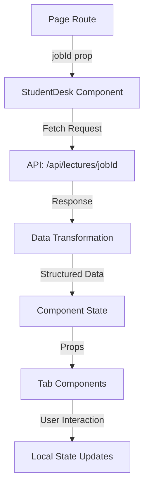

# StudentDesk Architecture Documentation

## Table of Contents
1. [Overview](#overview)
2. [Architecture & Data Flow](#architecture--data-flow)
3. [Core Components](#core-components)
4. [API Integration](#api-integration)
5. [Key Features](#key-features)
6. [File Structure](#file-structure)
7. [Data Models](#data-models)
8. [Usage & Integration](#usage--integration)
9. [Implementation Details](#implementation-details)

## Overview

The **StudentDesk** is a comprehensive study interface component in the Mindsy application that provides students with an organized, tab-based learning environment for processing and studying lecture content. It transforms raw lecture data into an interactive, multi-faceted learning experience.

### Purpose
- Display structured lecture content in an organized, digestible format
- Provide interactive study tools including questions, explanations, and summaries
- Enable seamless navigation between different content types
- Support both desktop and mobile learning experiences

### Key Capabilities
- 6-tab navigation system for different content types
- Interactive quiz questions with immediate feedback
- Mobile-optimized with swipe gestures
- State preservation across tab switches
- Real-time data loading from backend APIs
- PDF and material downloads

## Architecture & Data Flow

### Component Hierarchy
```
StudentDesk (Main Container)
├── Header (App Bar)
│   ├── Back Navigation
│   └── Lecture Metadata Display
├── TabNavigation (Tab Strip)
│   └── 6 Tab Buttons with Icons
└── Tab Content Area
    ├── OverviewTab
    ├── QuestionsTab
    │   ├── MultipleChoice
    │   ├── TrueFalse
    │   └── FillNumber
    ├── ExplanationsTab
    ├── SummaryTab
    ├── StudyTimeTab
    └── MaterialsTab
```

### Data Flow



1. **Route Parameter**: The `jobId` is passed from the page route (`/dashboard/lectures/[jobId]/student-desk`)
2. **API Call**: StudentDesk fetches data from `/api/lectures/[jobId]`
3. **Data Transformation**: Raw API response is transformed to match component structure
4. **State Management**: Data stored in component state with loading/error handling
5. **Tab Rendering**: Active tab receives relevant data slice as props
6. **User Interactions**: Each tab manages its own local state for interactions

## Core Components

### 1. StudentDesk Component (`StudentDesk.tsx`)
**Location**: `/components/student-desk-v2/StudentDesk.tsx`

The main container component that orchestrates the entire study interface.

**Key Responsibilities:**
- Fetches lecture data from API
- Manages active tab state
- Handles data transformation
- Implements touch/swipe gestures for mobile
- Preserves scroll positions between tabs
- Error and loading state management

**State Management:**
```typescript
- activeTab: Current selected tab ID
- lectureData: Transformed lecture content
- loading: Loading state indicator
- error: Error message if fetch fails
- tabScrollPositions: Ref storing scroll positions per tab
```

### 2. TabNavigation Component (`TabNavigation.tsx`)
**Location**: `/components/student-desk-v2/TabNavigation.tsx`

Renders the horizontal tab strip with icon-based navigation.

**Tabs:**
1. **Overview** (Eye icon) - Main topic and objectives
2. **Questions** (HelpCircle icon) - Interactive quiz questions
3. **Explanations** (BookOpen icon) - Detailed concept explanations
4. **Summary** (FileText icon) - Key points and exam focus
5. **Study Time** (Clock icon) - Study metrics and gamification
6. **Materials** (FolderOpen icon) - Downloadable resources

### 3. Tab Components

#### OverviewTab (`tabs/OverviewTab.tsx`)
Displays lecture metadata and learning objectives:
- Main topic description
- Key learning objectives (numbered list)
- Core concepts list
- Difficulty and time estimates

#### QuestionsTab (`tabs/QuestionsTab.tsx`)
Manages interactive quiz questions:
- Groups questions by difficulty
- Renders appropriate question handler based on format
- Displays total points and question count
- Handles question validation

#### ExplanationsTab (`tabs/ExplanationsTab.tsx`)
Presents detailed concept explanations:
- Concept cards with importance levels
- Key points and examples
- Visual aids when available
- Structured explanation hierarchy

#### SummaryTab (`tabs/SummaryTab.tsx`)
Provides condensed study material:
- Essential points list
- Exam-focused content
- Must-know concepts
- Likely exam questions

#### StudyTimeTab (`tabs/StudyTimeTab.tsx`)
Shows study progress and gamification:
- Quiz metrics (total questions, points, passing score)
- Achievements system
- Study session tracking
- Time estimates

#### MaterialsTab (`tabs/MaterialsTab.tsx`)
Manages downloadable resources:
- PDF lecture notes
- JSON data files
- Text and Markdown formats
- Secure file viewing/downloading

### 4. Question Handler Components

Located in `/components/student-desk-v2/question-handlers/`:

#### MultipleChoice.tsx
- Radio button selection
- Submit/Try Again functionality
- Immediate feedback with correct answer
- Hint display
- Point tracking

#### TrueFalse.tsx
- Binary choice questions
- Statement evaluation
- Feedback mechanism

#### FillNumber.tsx
- Numerical input questions
- Range validation
- Unit display
- Acceptable range checking

## API Integration

### Primary Endpoint: `/api/lectures/[jobId]/route.ts`

**Response Structure:**
```typescript
{
  lecture: {
    id: string,
    data: {
      metadata: {...},
      overview: {...},
      questions: [...],
      explanations: [...],
      summary: {...},
      engagement: {...}
    }
  },
  stats: {
    estimatedMinutes: number,
    completedSessions: number,
    lastAccessed?: string
  },
  materials: [...]
}
```

### Data Transformation Process

The component transforms API response to internal structure:

```typescript
const transformedData = {
  metadata: {
    title: lectureData.metadata?.title || 'Untitled Lecture',
    difficulty: lectureData.metadata?.difficulty || 'intermediate',
    estimatedTime: lectureData.metadata?.estimatedTime || '30 minutes',
    subjectDomain: lectureData.metadata?.subjectDomain || 'General',
    examImportance: lectureData.metadata?.examImportance || 'medium'
  },
  overview: {
    mainTopic: lectureData.overview?.mainTopic || 'No overview available',
    keyObjectives: lectureData.overview?.keyObjectives || [],
    coreConceptsList: lectureData.overview?.coreConceptsList || []
  },
  questions: lectureData.questions || [],
  explanations: (lectureData.explanations || []).map(exp => ({
    id: exp.id || `exp-${index}`,
    concept: exp.concept || 'Concept',
    importance: exp.importance || 'medium',
    explanation: exp.explanation || '',
    keyPoints: exp.keyPoints || [],
    example: exp.example,
    visual: exp.visual
  })),
  // ... additional transformations
}
```

### Error Handling
- Network failures display retry button
- Missing data shows fallback content
- Validation errors logged to console
- User-friendly error messages

## Key Features

### 1. Tab State Preservation
Each tab's scroll position is preserved when switching:
```typescript
tabScrollPositions.current[activeTab] = mainContentRef.current.scrollTop;
```

### 2. Mobile Swipe Navigation
Touch gestures enable swiping between tabs:
- Horizontal swipe detection
- Threshold-based navigation (50px)
- Prevents vertical scroll interference

### 3. Responsive Design
- Mobile-first approach
- Touch-optimized controls
- Adaptive layouts per screen size
- Icon-only navigation on mobile

### 4. Interactive Learning
- Immediate quiz feedback
- Hint system
- Progress tracking
- Achievement system

### 5. Loading States
- Skeleton screens during load
- Spinner with status messages
- Progressive content reveal

## File Structure

```
/components/student-desk-v2/
├── StudentDesk.tsx                 # Main container component
├── TabNavigation.tsx               # Tab strip navigation
├── tabs/
│   ├── OverviewTab.tsx            # Learning objectives display
│   ├── QuestionsTab.tsx           # Quiz question manager
│   ├── ExplanationsTab.tsx        # Concept explanations
│   ├── SummaryTab.tsx             # Key points summary
│   ├── StudyTimeTab.tsx           # Progress tracking
│   └── MaterialsTab.tsx           # Resource downloads
└── question-handlers/
    ├── MultipleChoice.tsx          # MCQ component
    ├── TrueFalse.tsx              # T/F component
    └── FillNumber.tsx             # Numerical input

/app/dashboard/lectures/[jobId]/
└── student-desk/
    └── page.tsx                    # Route page component

/app/api/lectures/[jobId]/
├── route.ts                        # Main data endpoint
└── structured/
    └── route.ts                    # Structured content endpoint
```

## Data Models

### Core TypeScript Interfaces

```typescript
interface StudentDeskProps {
  jobId: string;
}

interface LectureData {
  metadata: {
    title: string;
    difficulty: string;
    estimatedTime: string;
    subjectDomain: string;
    examImportance: string;
  };
  overview: {
    mainTopic: string;
    keyObjectives: string[];
    coreConceptsList: string[];
  };
  questions: Question[];
  explanations: Explanation[];
  summary: {
    essentialPoints: string[];
    examFocus: {
      mustKnow: string[];
      likelyQuestions: string[];
    };
  };
  engagement: {
    quizMetrics: {
      totalQuestions: string | number;
      totalPoints: string | number;
      passingScore: string | number;
    };
    achievements: Achievement[];
  };
}

interface Question {
  id: string;
  type: string;
  topic: string;
  format: 'multiple-choice' | 'true-false' | 'fill-number';
  question?: string;
  choices?: string[];
  correctAnswer?: number | boolean;
  statement?: string;
  template?: string;
  answer?: number;
  acceptableRange?: [number, number];
  unit?: string;
  hint?: string;
  feedback?: string;
  difficulty?: string;
  points?: number;
}
```

## Usage & Integration

### Basic Implementation

```tsx
// In your page component
import StudentDesk from '@/components/student-desk-v2/StudentDesk';

export default function LecturePage({ params }) {
  const { jobId } = params;
  return <StudentDesk jobId={jobId} />;
}
```

### Route Configuration

The component is typically accessed via:
```
/dashboard/lectures/[jobId]/student-desk
```

### Required Props
- `jobId`: Unique identifier for the lecture content

### Authentication
- Component requires authenticated user
- API endpoints validate user session
- User-specific content filtering

## Implementation Details

### Performance Optimizations
1. **Lazy Loading**: Tab content only renders when active
2. **Memoization**: Expensive computations cached
3. **Debounced API Calls**: Prevents excessive requests
4. **Virtual Scrolling**: For long content lists (planned)

### Accessibility Features
- ARIA labels on all interactive elements
- Keyboard navigation support
- Screen reader friendly structure
- High contrast mode support
- Focus management

### Browser Compatibility
- Modern browsers (Chrome, Firefox, Safari, Edge)
- Mobile browsers (iOS Safari, Chrome Mobile)
- Progressive enhancement approach

### State Management Strategy
- Local component state for UI
- No global state dependency
- Props drilling minimized
- Refs for non-rendering data

### Error Boundaries
- Component-level error catching
- Graceful degradation
- User-friendly error messages
- Retry mechanisms

## Future Enhancements

### Planned Features
1. **Offline Support**: Cache content for offline study
2. **Progress Persistence**: Save quiz progress to database
3. **Note-Taking**: Integrated note system per tab
4. **Collaborative Features**: Share notes with classmates
5. **AI Tutor**: Interactive Q&A system
6. **Analytics**: Detailed study pattern tracking

### Technical Improvements
1. **Code Splitting**: Dynamic imports for tab components
2. **WebSocket Integration**: Real-time updates
3. **Service Worker**: Background sync and caching
4. **Virtualization**: Handle thousands of questions
5. **PWA Features**: Install as app, push notifications

## Troubleshooting

### Common Issues

1. **Data Not Loading**
   - Check API endpoint availability
   - Verify authentication status
   - Check jobId validity

2. **Tab Navigation Issues**
   - Clear browser cache
   - Check for JavaScript errors
   - Verify TabNavigation component rendering

3. **Question Components Not Working**
   - Validate question data format
   - Check question handler imports
   - Verify state updates

4. **Mobile Swipe Not Working**
   - Check touch event handlers
   - Verify threshold values
   - Test on actual device

## Conclusion

The StudentDesk component represents a sophisticated, user-centered approach to digital learning interfaces. Its modular architecture, comprehensive feature set, and thoughtful UX design make it a cornerstone of the Mindsy platform's educational experience. The component successfully balances functionality with performance while maintaining clean, maintainable code that can be easily extended for future requirements.