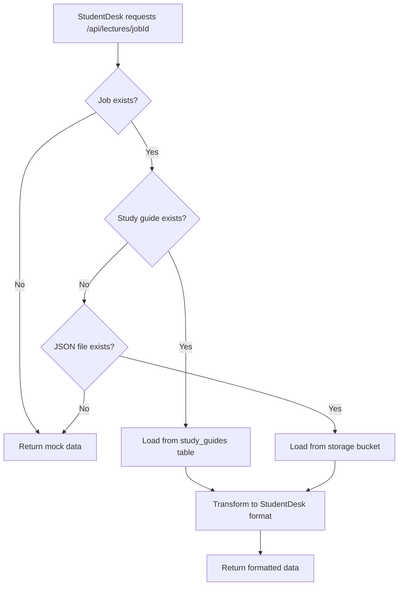

# StudentDesk Data Integration

## What We Did

We implemented **Option 1: Quick Fix - Load from JSON file** to display real data in the StudentDesk component instead of mock data.

### Changes Made

1. **Created Data Transformer** (`/lib/lecture-data-transformer.ts`)
   - Transforms Cornell Notes format (current) → StudentDesk format (needed)
   - Handles missing fields with sensible defaults
   - Maps question types, difficulties, and importance levels

2. **Updated API Route** (`/app/api/lectures/[jobId]/route.ts`)
   - Now fetches real data from database
   - Loads from `study_guides` table first (most reliable)
   - Falls back to JSON file if available
   - Falls back to mock data if nothing found
   - Transforms data to StudentDesk format

3. **Enhanced StudentDesk Component**
   - Added better logging for data validation
   - Improved secondary tabs data mapping (Content Summary, Mind Map)

### How It Works



## Testing

### 1. Test the Transformation
```bash
# In development mode, test the transformation
curl http://localhost:3001/api/debug/test-transformation?jobId=YOUR_JOB_ID
```

### 2. Test StudentDesk Display
1. Navigate to a lecture: `/dashboard/lectures/[jobId]/student-desk`
2. Check browser console for logs:
   - "📚 Loading lecture data for: [jobId]"
   - "✅ Raw API response"
   - "📊 Lecture data loaded"

### 3. Verify Data Flow
The API now:
- ✅ Loads real data from database
- ✅ Transforms Cornell Notes → StudentDesk format
- ✅ Handles missing fields gracefully
- ✅ Falls back to mock data if needed

## Data Format Mapping

### Cornell Notes (Generated)
```json
{
  "metadata": { "title", "subject", "language" },
  "questions": [{ "question", "answer", "type" }],
  "explanations": [{ "title", "content", "keyPoints" }],
  "summary": { "overview", "keyTakeaways", "learningObjectives" }
}
```

### StudentDesk (Expected)
```json
{
  "metadata": { "title", "difficulty", "estimatedTime", "subjectDomain" },
  "overview": { "mainTopic", "keyObjectives", "coreConceptsList" },
  "questions": [{ "statement", "feedback", "difficulty", "points" }],
  "explanations": [{ "concept", "importance", "explanation", "keyPoints" }],
  "summary": { "essentialPoints", "examFocus" }
}
```

## Next Steps (Future Improvements)

1. **Option 2**: Load directly from study_guides table (faster, no file download)
2. **Option 3**: Switch to `generateStudentDeskContent` for new content
3. **Add caching**: Cache transformed data to improve performance
4. **Add transcript support**: Integrate actual transcript data when available

## Troubleshooting

If data isn't showing:
1. Check if job exists: `SELECT * FROM jobs WHERE job_id = 'YOUR_ID';`
2. Check if study guide exists: `SELECT * FROM study_guides WHERE job_id = 'YOUR_ID';`
3. Check if JSON file exists: Look for `json_file_path` in jobs table
4. Check browser console for error messages
5. Use debug endpoint to test transformation

## Important Notes

- **No database changes required** - Works with existing schema
- **Backwards compatible** - Doesn't break existing functionality
- **Safe fallbacks** - Always returns valid data (mock if needed)
- **No regeneration needed** - Works with all existing content